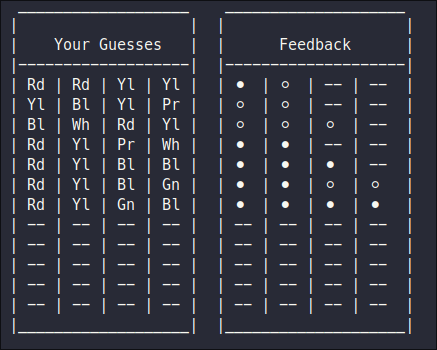

# Mastermind
This is a terminal version of the board game Mastermind.
It allows the player to play both as the codebreaker and the codebreaker.
Either making the code and watching the computer trying to guess it or trying to guess to code made by the computer.

This project is based on the Mastermind Assigement from [The Odin Project curriculum](https://www.theodinproject.com/).

# Skills
### After making it I learned:
- More Advanced OOP in ruby
- Creating simple algorithims
- Better Ruby syntax
- A better usage of classes in OOP

# Tech
### This project was made with:
[Ruby]

